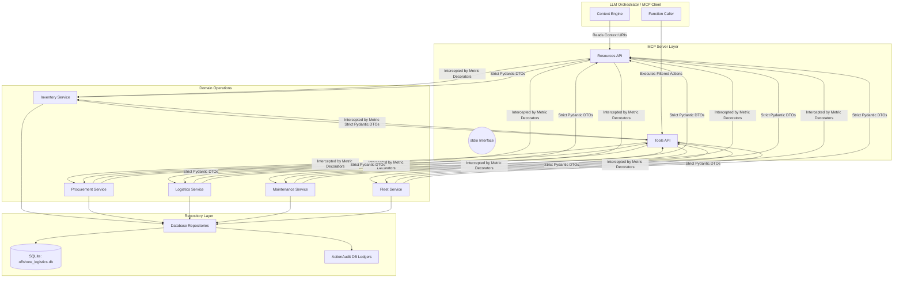

# Architecture & Data Flow

This project implements a Model Context Protocol (MCP) server designated to act as the **Operational Intelligence Layer** between an LLM Orchestrator (Client) and an offshore maritime database.

## Layered Design Pattern
The server strictly enforces domain-driven bounds to ensure AI interactions remain secure, predictable, and fully decoupled from underlying storage schemas.

### 1. Database as Operational Truth (Data Layer)
All actual logistics telemetry (shipments, warehouses, critical events) resides strictly in the relational SQLite database setup by `schema.sql`.

### 2. Repositories (Data Access)
Repositories (`inventory_repo.py`, etc) are the exclusive entry point for SQLAlchemy queries and database joins. They map complex SQL queries mapping to raw Data Models.

### 3. Business Service Layer
Services orchestrate logic bridging raw data models and external requirements. Because this is an *AI-first* backend, Services perform specific heuristic calculations:
- `ProcurementService`: Derives **`operational_risk_status`** natively by weighing the `expected_delivery` timestamps against today's date rather than relying on standard DB statuses.
- `InventoryService`: Validates numeric feasibility constraints during a `reserve_stock` attempt and gracefully translates insufficient funds into specific `DomainExceptions` rather than raw SQL failures.

### 4. FastMCP Handlers
The entry point script handles stdio handshakes natively using `mcp[cli]`. Functions wrapped in `@mcp.tool()` act strictly as parameter validation and Error-Catchers, shielding the host platform from unexpected tracebacks. No logic lives inside the handler!
